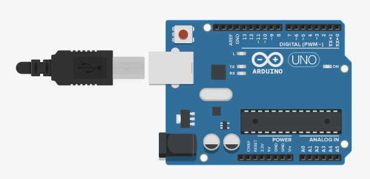
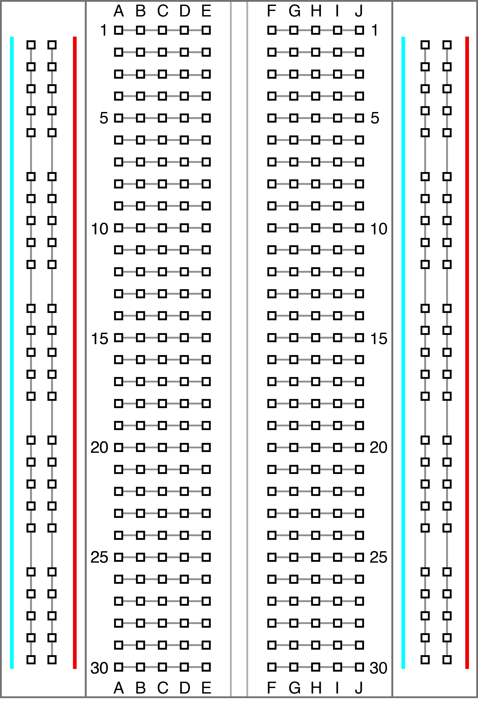
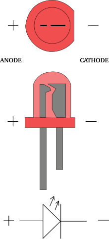
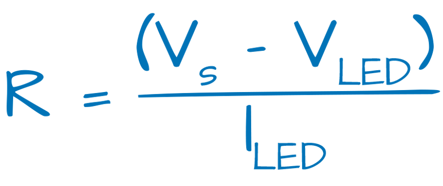
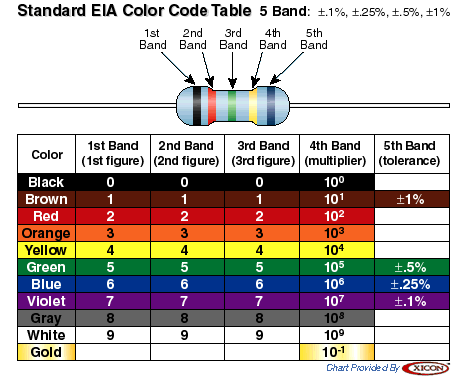

# Blink a LED
This is the first in a series of workshop designed to introduce Roslyn Code Club to the basics of Arduino.
In this workshop, we will learning the very basics of Arudino, breadboarding, and circuit design. In the end,
we will blink an LED with the Arudino.

This workshop is meant to go along with the Arduino Kits included. You must also have the Arduino IDE
or online editor available. 

You will need:
<ul>
    <li>1 Arduino UNO</li>
    <li>1 breadboard</lI>
    <li>1 LED</li>
    <li>1 220ohm resistor</li>
    <li>jumper wires</li>
</ul>

## Introduction

First, we will look and learn about all the components we will be using in this workshop. We will be using:
an Arduino UNO, a breadboard, an LED, and a resistor. It is always critical to know what you are working
with before you start a project, as if handled incorrectly, you can damage the material or even be a danger
to yourself.

### Item 1: Arduino 


Arduino is an open-source electronics platform based on easy-to-use hardware and software. 
Arduino boards can read inputs - light on a sensor, a finger on a button, or a Twitter message - 
and turn it into an output - activating a motor, turning on an LED, publishing something online. 
You can tell your board what to do by sending a set of instructions to the microcontroller on the board
with the Arduino IDE.

We will be using the Arduino UNO. This is the most common flavor of Arduino and can be used for a wide variety
of applications. 

If we take a closer look at the pins, we can see on there are rows for power, analog-in, and digital.
The power pins are used to provide power to your circuit.

##### Analog vs. Digital vs. PWM~
Now, we must distinguish between analog and digital.
An <b>analog</b> device is something that can have varying levels of power, while a <b>digital</b> device is something that
has only two level: off (0) and on (1). The analog-in pins (A0 to A5) are able to read signals from an analog sensor
(such as a photoresistor or a temperature sensor) and convert it into a digital value that we can read. 
The digital pins (0 to 13) can be used for both input and output of digital devices (such as a LED). 


However, some of the digital pins are <b>pulse-width modulation (PWM)</b> (3, 5, 6, 9, 10, and 11). 
These pins act as normal digital pins, but can also be used to simulate varying levels of output by
quickly switching from on to off to on again, resulting you being able to do things like dim a LED.

### Item 2: Breadboard


A breadboard is a tool we use to make experimental circuits without the need to solder or tape wires together.
It allows us to make temporary electrical connections using jumper wire. Looking at a standard breadboard,
there are 3 sections: the <b>"power rails"</b> on the two sides, and the main body called the <b>"terminal 
strips"</b> which is separated in the middle by a skinny bridge. In addition, each hole is 
labeled by a row number and column letter.

Breadboards work by making an electrical connection between all the pins in each row on a single side of the 
main body. For example, <i>A1 B1 C1 D1 and E1</i>, are all electrically connected, which is separated from
<i>F1 G1 H1 I1 and J1</i>, when is also separate from <i>A2 B2 C2 D2 and E2</i>. 

Additionally, the power rails make horizontal power connections. Often used for supplying power to the circuit
being built, the  <font color="red">positive rail</font> (labeled in  <font color="red">red +</font>) make connections between each of its pins, and the same holds 
for the <font color="blue">negative rail</font> (labeled in<font color="blue"> blue -</font>).

### Item 3: LED



An LED, or <b>light-emitting diode</b>, is like a small lightbulb. The ones used in circuits come in many sizes, usually ranging
from 3mm to 10mm. The ones we will be using are 5mm. The operating voltage and current can usually be found online.

The polarity of an LED is important when connecting it to a circuit. The <b>cathode</b> (negative end) will
always be the shorter lead, and closer to the flat end of the LED.
The <b>anode</b> (positive end) will always be the longer lead, and father away from the flat end. It is important
to connect the right leads to the right polarity for the LED to light up.

IMPORTANT: one of the most important things to keep in mind when working with LEDS (or any electrical component) is 
to not provide more power than what it is rated for. The LEDs we are working with have a typical voltage of 2.4V at
20mA, but the Arduino provides 5V. Thus, we need to step down the voltage.

### Item 4: Resistor



A resistor is a passive two-terminal electrical component that implements electrical resistance as a circuit element.
In this workshop, we will be using it to step down the 5V provided by the Arduino to about voltage needed for the LED.
We will be using a red LED, so the voltage is about ~2V, and 15mA gives good visibility. 

To calculate the resistor value we need, we use Ohm's Law: R (resistance) = V (voltage) / I (current). The operating current 
we will use is 2V, with an input current of 5V, so the V value is 5-2 = 3. The current is 15mA, which is equivalent 
to .015A. Thus, 3/.015 = 200ohm. The closest resistor value we have close to 200ohm is 220ohm, so we will be using that resistor.

To know which resistor is the 220ohm one, we use a resistor color chart to calculate it. This is show below.



## Building a Simple Circuit

### Step 1: Connection the power rails

Now we can finally start building a simple circuit. First, we want to connect the power rails
of the breadboard to power. Using <b>jumper wires</b> (doesn't matter what color), connect the `5V`pin on the Arduino
to the <font color="red">positive rail</font>. Then, connect `GND` to the <font color="blue">negative rail</font>.


### Step 2: Lighting an LED

Then, to power a LED, we must first step down the voltage of the 5V currently being supplied to 
around 2.1V, the operating voltage of an LED. This can be accomplished using a 220ohm resistor. Connect
the <b>resistor</b> (doesn't matter which end) from the <font color="blue">negative power rail</font> to one of the terminal strips. Next, run a 
<b>jumper wire</b> from the<font color="red"> positive rail</font> to a different terminal strip near the first one. Finally, connect the
<b>LED</b>'s longer leg (<font color="red">anode +</font>) to the same row as that shares the wire to the <font color="red">positive rail</font>, and the 
shorter leg (<font color="blue">cathode -</font>) to the rail with the resistor on it. You should see the LED light up. 


### Step 3: Connecting LED to output 
For the LED to be controlled by the Arduino, it must be hooked up to one of the output pins.
We can use any digital pin, but we will use a ~PWM enabled pin to allow us to dim it later. Unplug the 
jumper wire connecting the positive rail to the anode of the LED. Then, use another wire to connect the anode
to pin `~3`.


## Controlling LED with Arduino

### Step 1: Commenting and Defining Pins
To program the Arduino to blink, we use the Arduino IDE. We will be using the 
<a href="https://create.arduino.cc/editor" target="_blank"> Arduino Online Editor</a>.

Create a new sketch and the default will always be:
```
/*

*/

void setup() {
    
}

void loop() {
    
}
```

It is always good to add something in the comments on the top, such as your name, date, and a brief description about the code.
Then we want to define a variable after the comment, but before everything else,
called `LED` to `3` as that is the pin number we connected the LED to.

```
/*
by Jeffrey Yu, February 18, 2018
Simple project created for Roslyn Code Club's Blink a LED workshop.
This code will blink and fade an LED.
*/

int LED = 3; //the PWM pin the LED is connected to

void setup() {
    
}

void loop() {
    
}
```

### Step 2: Setup

In the setup portion of the code, we want to define which pins do what. In our case, we only have one pin
in use, and it is an output pin. This can be defined by using `pinMode()`, as show below:

```
/*
by Jeffrey Yu, February 18, 2018
Simple project created for Roslyn Code Club's Blink a LED workshop.
This code will blink and fade an LED.
*/

int LED = 3; //the PWM pin the LED is connected to

void setup() {
    pinMode(LED,OUTPUT); //declares pin 3 an output
}

void loop() {
    
}
```

### Step 3: Blinking the LED

Now, we can finally blink the LED. To turn on the LED, we use `digitalWrite()` as we are either providing 
`HIGH` (full power, LED on) or `LOW` (no power, LED off). Then, we can use `delay()` to add a pause between
the LED being turned on and off, measured in milliseconds. This is all placed in the `loop` section of
the code, where it will be looped indefinitely. 

```
/*
by Jeffrey Yu, February 18, 2018
Simple project created for Roslyn Code Club's Blink a LED workshop.
This code will blink and fade an LED.
*/

int LED = 3; //the PWM pin the LED is connected to

void setup() {
    pinMode(LED,OUTPUT); //declare pin 3 to be an output
}

void loop() {
    digitalWrite(LED, HIGH); //turns on the LED
    delay(1000); //waits 1 second
    digitalWrite(LED, LOW); //turns off the LED
    delay(1000); // waits 1 second 
}
```

### Step 4: Uploading

To upload the code to the Arduino, make sure the Arduino is connected to your computer.
On the top, in the dropdown menu select `Arduino/Genuino UNO`. Then click the check to verify the code.
If all goes well and no errors pop up, press the arrow and the code will be sent to the Arduino.
Wait a few seconds and now you should see the LED blinking. <b>Congratulations!</b> You have now made a circuit
controlled by a microcontroller.

You can now experiment with the code by changing the interval between turning on and off.
