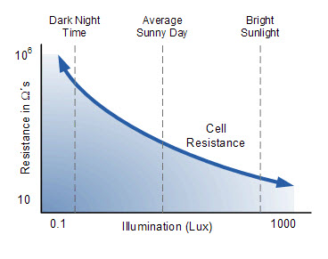
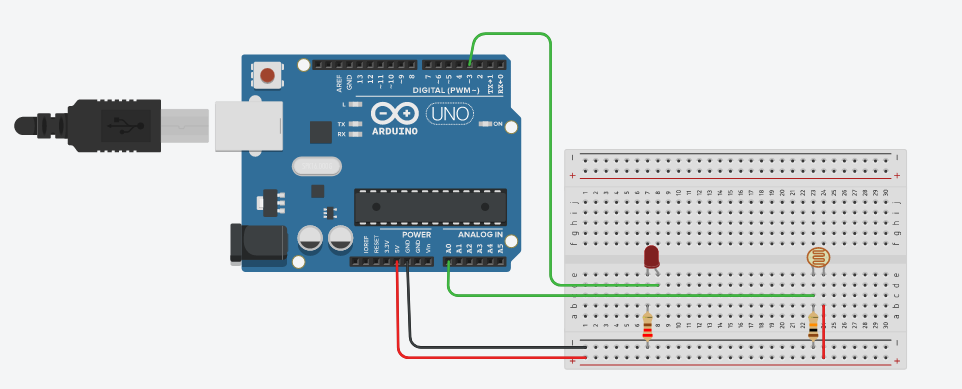

# Auto-Flashlight

In this workshop, we will be using a photoresistor and a LED to build a flashlight that responds 
to the brightness of its surroundings. You will learn how to dinm a LED, use a photoresistor as an analog input,
and how to calibrate and map sensor values.

You will need:
<ul>
    <li>1 Arudino UNO</li>
    <li>1 breadboard</li>
    <li>1 LED (any color)</li>
    <li>1 220ohm resistor</li>
    <li>1 10Kohm resistor</li>
    <li>jumper wires</li>
</ul>

## Photoresistors

Photoresistors are a simple and cheap way to integrate a light sensor into any circuit. 
They are exactly what the name implies: resistors that are based on light. As light intensity increases,
the cell resistance decreases, creating a resistance curve (pictured below). 

  


## Part I: Building the Circuit

The circuit built here will be very similiar to the button circuit built in the last workshop, except
instead of a button, we use a photoresistor. Thus, I will not explain each step here. If you need to, you can go back to understand the circuit.

### Setup Breadboard and Connect LED to Output
<b>Step 1:</b> Connect the `5V` pin to the positive power rail.
<br><b>Step 2:</b> Connect the `GND` pin to the negative power rail.
<br><b>Step 3:</b> Place a LED on the breadboard with the longer leg on one row, and the shorter leg on the row above.
<br><b>Step 4:</b> Connect digital pin `~3` to the same row as the longer leg of the LED (lower row).
<br><b>Step 5:</b> Place a 220 ohm resistor connecting the shorter leg (higher low) of the LED to negative rail.

An example circuit is shown below:


### Connect Photoresistor to Input
<b>Step 1:</b> Place a photoresistor on the breadboard with the two legs in two different rows (polarity doesn't matter).
<br><b>Step 2:</b> Connect one leg of the photoresistor to the positive rail.
<br><b>Step 3:</b> Place a 10K ohm resistor (acts as step-down resistor) connecting the other leg of the photoresistor to the negative rail.
<br><b>Step 4:</b> Connect the row with the 10K ohm resistor and photoresistor to pin `A0`.



## Part II: Coding

Now comes the fun part: coding! A number of different things must happen for this project to work.

### Setup

As always, first we must setup the code. This involves adding a heading: dating and giving a brief context of the
code. In `setup()` we will need to define pin numbers and pins as inputs or outputs. Your setup code might look something like this:

```
/*
by Jeffrey Yu, March 7, 2018
for Roslyn Code Club's "Auto-Flashlight" workshop
*/

int sensor = AO;    //pin the photoresistor is connected to
int LED = 3         //pin the LED is connected to

void setup() {
    pinMode(LED, OUTPUT);   //declare pin 3 to be an OUTPUT
}

```

Then, 
we want the LED to dim based on the intensity of the light, so we have to somehow convert the value being
read from the photoresistor input to an output value for the LED. The value can not be directly fed
to the output, as the input value range is unkown, but output values range from 0 to 255.