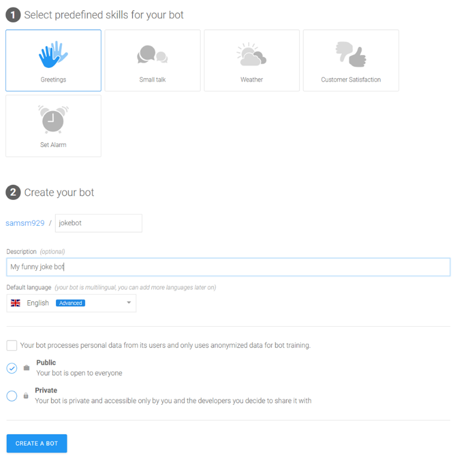

# Making Your First Bot Using Recast.ai
*This workshop was adapted from a workshop made by Justine Baron, posted on the Recast.AI website. It is available at https://recast.ai/blog/build-your-first-bot-with-recast-ai/*

### Getting Started with Recast.ai

[Recast.AI](https://recast.ai) is a platform for building and trianing bots. We will utilize their services to get started on basic bot-making. 

As a method of storing all your code in the future, and as tool to connect your Recast.AI account with, we will use [Github](https://github.io). You can sign up for a github [here](https://github.io) and then for Recast.AI [here](https://github.com/login?client_id=02e7d65e4478690814f2&return_to=%2Flogin%2Foauth%2Fauthorize%3Fclient_id%3D02e7d65e4478690814f2%26scope%3Duser%253Aemail%252Cprofile%26state%3DeyJ0eXAiOiJKV1QiLCJhbGciOiJIUzUxMiJ9.eyJvcmlnaW4iOiJwbGF0Zm9ybSIsImZyb20iOiJmcm9tLXNpZ251cCIsInNlcnZpY2UiOm51bGwsInVzZXIiOm51bGwsImJvdCI6bnVsbH0.A_m5JMk5T8b2sKPlKIznluqc2jeoJkOK4UFdNU3JdGpwLkjcxQpKZd47tXg8IVa_rcO7S9rKndB0bxQQ3KLyjA).

### Creating the Bot

Once you’re logged in, you can create your first bot. Click on the button `Start with a template`, or just on `+ NEW BOT` in the header section.

Choose `Create a complete chatbot`.

You can choose one or many pre-defined skills for you bot. This will help you get started faster. Just select `Greetings` for now, but I encourage you to check the others later.

Choose your name. `joke-bot` would be appropriate.

Add a description. `My funny joke bot` or something similarly descriptive.

Set `English` as the default language.

You can keep your bot public as there is no private info, but you can change this setting later.



### The Stages of Bot-Building

There are 5 phases in your bot life, represented on the Recast.AI platform through the use of 5 tabs:

- Train – Teach your bot what it needs to understand
- Build – Create your conversational flow with our Bot Builder tool
- Code – Connect your bot with external APIs or a database
- Connect – Ship your bot to one or several messaging platforms
- Monitor – Train your bot to make it sharper, and get insights on its usage!

For this tutorial, we’ll skip the `Code` part, because we won’t need any external information. In future tutorials, we will rely on code more and more as our bot-making skills increase.

### Train Your Bot to Understand Human Language

This is the brain of your bot, where all its understanding is gathered, divided into intents.

An intent is a "box" of sentences that all carry the same meaning, even though they can be very different to one another. When a user sends some text to your bot, our algorithm compares it to the phrases in your intents. Then it checks if it’s close enough to one of them and decides what the intention of the message is.

For example:

```
Are you a bot?
<br>
You reply so fast, I’m sure you must be some kind of robot.
<br>
Am I speaking to a human or not?
```
are all different, but they all ask the same question that we can can sum up as: `Are you a bot?` 

That would make a great intent! If your bot is able to recognize this question, you can prepare a smart reaction, like `I’m a robot and I’m proud of it`.

### Fork Intents

All bots should understand basic things such as `greetings`, `agree`, `disagree`, or when a user asks for help.

If you chose the pre-defined Skill `Greetings` when you setup your bot, you will already have two intents: `goodbye` and `greetings`.

As Recast.AI is collaborative, you do not have to recreate each intent every time! You can 'fork' an intent someone already created to clone it right into your bot. Since we need to understand that our user wants to be told a joke, let’s find if the community has already created this intent for us.

Type “joke” in the input Search!

You can click on the intention names if you want to check their full content. The first result will work just fine for us.
