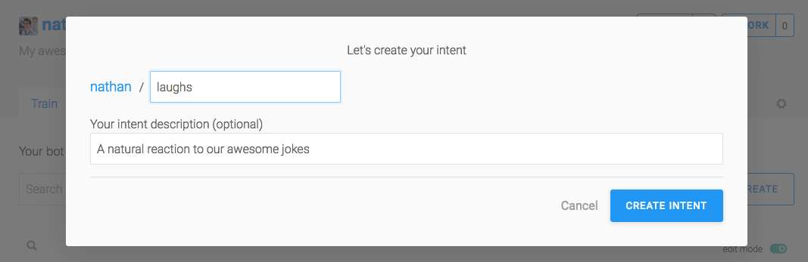
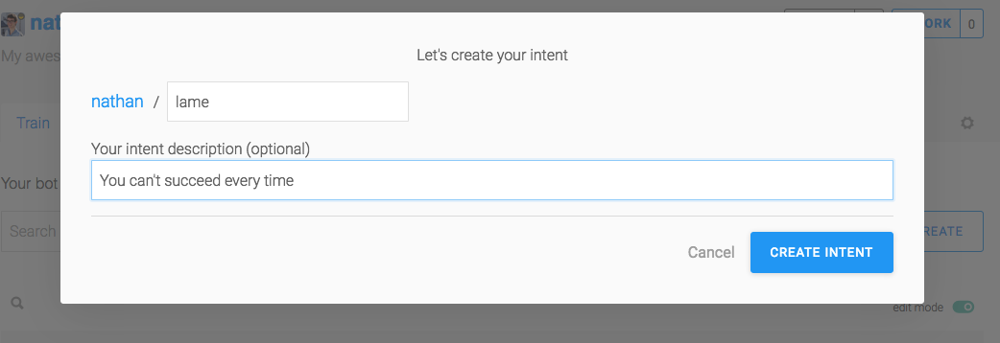
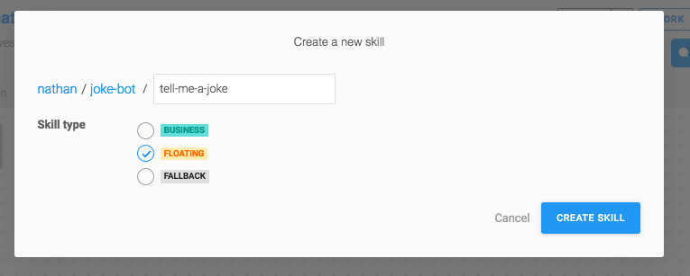
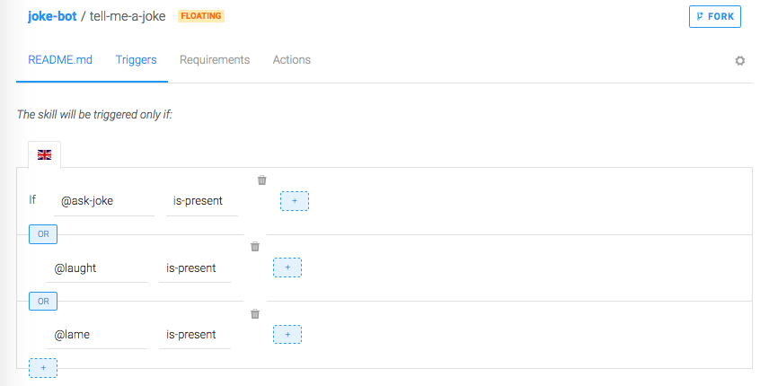

# Making Your First Bot Using Recast.ai
*This workshop was adapted from a workshop made by Justine Baron, posted on the Recast.AI website. It is available at https://recast.ai/blog/build-your-first-bot-with-recast-ai/*

### Getting Started with Recast.ai

[Recast.AI](https://recast.ai) is a platform for building and trianing bots. We will utilize their services to get started on basic bot-making. 

As a method of storing all your code in the future, and as tool to connect your Recast.AI account with, we will use [Github](https://github.io). You can sign up for a github [here](https://github.io) and then for Recast.AI [here](https://github.com/login?client_id=02e7d65e4478690814f2&return_to=%2Flogin%2Foauth%2Fauthorize%3Fclient_id%3D02e7d65e4478690814f2%26scope%3Duser%253Aemail%252Cprofile%26state%3DeyJ0eXAiOiJKV1QiLCJhbGciOiJIUzUxMiJ9.eyJvcmlnaW4iOiJwbGF0Zm9ybSIsImZyb20iOiJmcm9tLXNpZ251cCIsInNlcnZpY2UiOm51bGwsInVzZXIiOm51bGwsImJvdCI6bnVsbH0.A_m5JMk5T8b2sKPlKIznluqc2jeoJkOK4UFdNU3JdGpwLkjcxQpKZd47tXg8IVa_rcO7S9rKndB0bxQQ3KLyjA).

### Creating the Bot

Once you’re logged in, you can create your first bot. Click on the button `Start with a template`, or just on `+ NEW BOT` in the header section.

Choose `Create a complete chatbot`.

You can choose one or many pre-defined skills for you bot. This will help you get started faster. Just select `Greetings` for now, but I encourage you to check the others later.

Choose your name. `joke-bot` would be appropriate.

Add a description. `My funny joke bot` or something similarly descriptive.

Set `English` as the default language.

You can keep your bot public as there is no private info, but you can change this setting later.


### The Stages of Bot-Building

There are 5 phases in your bot life, represented on the Recast.AI platform through the use of 5 tabs:

- Train – Teach your bot what it needs to understand
- Build – Create your conversational flow with our Bot Builder tool
- Code – Connect your bot with external APIs or a database
- Connect – Ship your bot to one or several messaging platforms
- Monitor – Train your bot to make it sharper, and get insights on its usage!

For this tutorial, we’ll skip the `Code` part, because we won’t need any external information. In future tutorials, we will rely on code more and more as our bot-making skills increase.

### Train Your Bot to Understand Human Language

This is the brain of your bot, where all its understanding is gathered, divided into intents.

An intent is a "box" of sentences that all carry the same meaning, even though they can be very different to one another. When a user sends some text to your bot, our algorithm compares it to the phrases in your intents. Then it checks if it’s close enough to one of them and decides what the intention of the message is.

For example:

```
Are you a bot?
<br>
You reply so fast, I’m sure you must be some kind of robot.
<br>
Am I speaking to a human or not?
```
are all different, but they all ask the same question that we can can sum up as: `Are you a bot?` 

That would make a great intent! If your bot is able to recognize this question, you can prepare a smart reaction, like `I’m a robot and I’m proud of it`.

### Fork Intents

All bots should understand basic things such as `greetings`, `agree`, `disagree`, or when a user asks for help.

If you chose the pre-defined Skill `Greetings` when you setup your bot, you will already have two intents: `goodbye` and `greetings`.

As Recast.AI is collaborative, you do not have to recreate each intent every time! You can 'fork' an intent someone already created to clone it right into your bot. Since we need to understand that our user wants to be told a joke, let’s find if the community has already created this intent for us.

Type `joke` in the input Search!

You can click on the intention names if you want to check their full content. The first result will work just fine for us.

### Create a New Intent

If you want a custom intent, you can build it from scratch. Here, we want the bot to understand when someone laughs at the joke.

Click on `+ CREATE` on the right of the search field, and choose a name for your intent:



Repeat this process for intent that gathers negative reactions to your jokes:



### Add Expressions

Now that we have intents, we need to populate them with various expressions. An expression is the name of a sentence added to an intent.

A golden rule would be to add 20 expressions to an intent for a development bot, and 50 or more for a production bot.

Click on an intent and add sentences you want your bot to understand. Put yourself in the shoes of the people talking to your bot.What could they possibly ask? Enter a new expression by typing it into the field Add an expression. Here are some examples:

Laughs:
```
hahah that’s hilarious
<br>
ROFL you’re good!
<br>
That, my friend, was an amazing joke.
<br>
I haven’t laughed that much in a long time!
```
Lame:
```
You have no sense of humour whatsoever.
<br>
That’s both terrible and offensive.
<br>
What the heck was that?
<br>
Try harder, that was a very bad joke
```

### Test Your Bot

Now that your bot is full of expressions, let’s test it with the console:

Click on the TEST bubble icon on the top right, and type a sentence you have not trained your bot with, such as: `Botty bot, can you tell me a joke please?`

You will see which intent was detected under `User is referring to`. If the algorithm did not detect an intent, or detected an invalid intent (not the intent for asking a joke), that means that you need to train your bot with more expressions.

Once you’re happy with your bot intent detection, it’s time to move to next phase: building your bot flow.

### Build and Manage Conversation Flow

Now that the brain of your bot is all filled up, click on the `Build` tab.

The `Build` tab is where you find `Bot Builder`. It helps you construct the conversation flow of your bot using Skills.

### What is a Skill?

Each Skill represents one thing that your bot knows how to do, and they can interact with each other. Your skill can be a complicated one – such as managing payment by credit or simple – answering basic questions

When you create a new bot, forking skills you already made to the new one will keep making your bots more powerful. You can also fork skills created by other people on the platform, so you don’t have to reinvent the wheel!

If you chose the pre-defined skill `Greetings` during the creation of your bot, it will already be in your interface.

Click its name to check its details.

A skill has four parts:

- Readme: Where you explain the purpose of your skill.
- Triggers: Where you define why this skill should be activated after a user message
- Requirements: Describes what information this skill has to collect, and what questions need to be asked to fulfill the requirements.
- Actions: What to do once the requirements are fulfilled.

If you navigate through the tabs, you’ll see that this skill is structured as follows:
- It is triggered if the intention greetings or the intention goodbye are matched.
- It has no requirements, because it does not need to collect additional information. That means that it will execute actions directly after a trigger.
- It has two possible actions: If the intention matched is greetings, it sends a random welcoming message chosen from a list, and if the intention is goodbye, it does the same thing, but picks the message from a different list

It’s time to create our own Skill with the same structure.

### Build Your Own Skill

Go back to the Build tab and click on `+ Create skill` on the left.

You have three different types of skills: `Business`, `Floating`, and `Fallback`. On the one hand, `Business` and `Floating` have no structural differences. Yet differentiating the two types of skill helps when you have a lot of them. `Fallback` skills, on the other hand, trigger when no other skill has their Triggers fulfilled after a user message. Most of the time, you’ll have only one of this kind, where you can remind the user what your bot can do, and ask them to rephrase.

Our skill will be of `Floating` type. Give it the name you want, I chose `tell-me-a-joke`.



Double-click on the skill and go to the `Triggers` tab. We want to activate our skill if one of the three intentions we created are matched.

