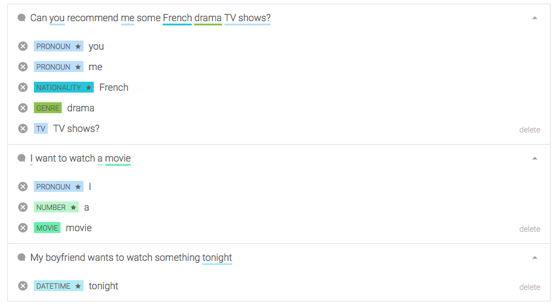
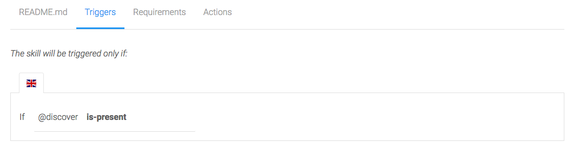
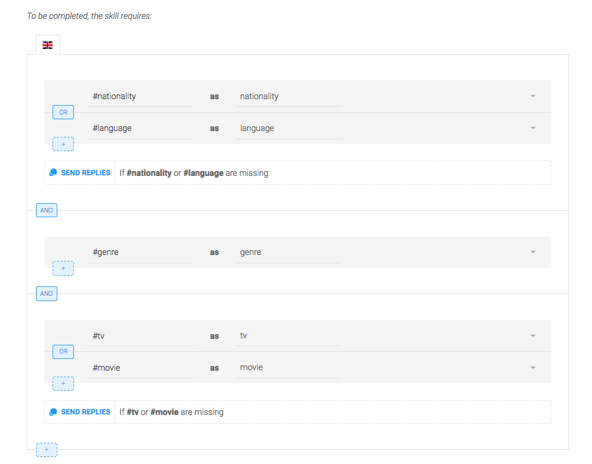
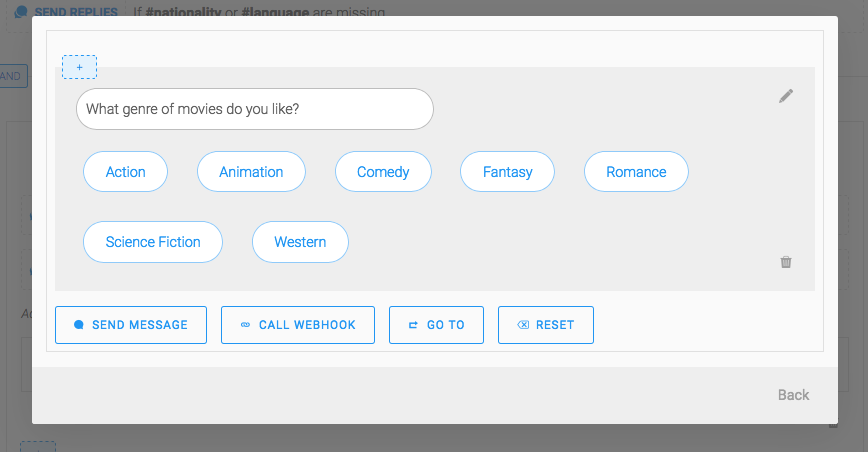
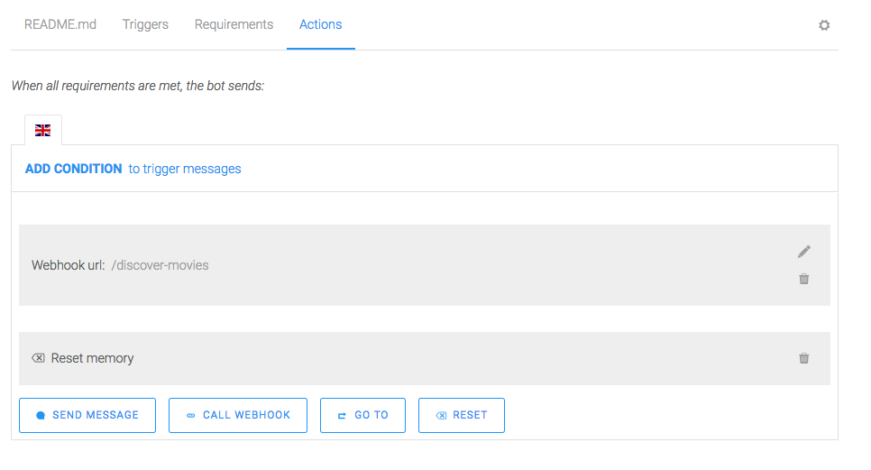

# NodeJS chatbot tutorial: A movie bot with Recast.AI
*This workshop was adapted from a workshop made by Justine Baron, posted on the Recast.AI website. It is available at https://recast.ai/blog/nodejs-chatbot-movie-bot/*

### Demo


### Making the Movie Bot

Interacting with third party APIs (such as The Movie Database) allows for much more interesting use cases that simple QnA chatbots. With Bot Skills, we added the option to call webhooks directly from the builder, which makes it even easier.

Today’s bot requires several steps:

- Extracting key pieces of information in a sentence
- Building the bot flow (triggers, requirements, actions)
- Creating and connecting a bot API able to fetch data from The Movie Database

You’ll need a Recast.AI account, Node.JS and potentially Ngrok for testing.

### Extracting Key Info From a Sentence

*Intents* are helpful to determine the overall meaning of a sentence. For our use case, knowing that the user wants to watch something is not enough.

We need to know what the users want to watch.

*Entities* are designed to solve this problem: they extract key information in a sentence.

>Intents make you understand that you have to do something. Entities help you actually do something.

The entities extracted will help understand what is going wrong, where and since when.

For our movie bot, we will try to extract 3 key pieces of information:

- What the user wants to watch (movie vs TV show)
- What genre they are looking for
- In which language

#### Using Gold Entities

To help you speed up your development, Recast.AI extracts several entities by default : Dates, locations, phone numbers, etc.

The `Language` entity will be helpful

See the little star next to the entity name? It differentiates a gold entity from a custom one.

We will use it to fulfill our third requirement: the movie language.

#### Creating Custom Entities

We will create custom entities to extract the information we need. As with intents, training is very important: the more examples you add to your bot, the more accurate it gets.

Training your entities can happen through multiple intents. Entities are independent of intents.

For our movie bot, we only need one intent, `discover-movies`, and 3 entities:

- `movie` to identify that the user wants to watch a movie
- tv for the same purpose but with TV shows
- `genre`

Open the intent `discover-movies` and add expressions. Make sure to cover every possibility, this means a healthy mix of expressions with:

- No entities at all: “My boyfriend wants to watch something tonight”
- One entity: “I want to watch a movie”
- Many entities: “Can you recommend me some French drama TV shows?”

To tag your expressions, select the text you want to tag and type your entity name:



You should add many more examples: 15 would be nice, but a production-ready bot would require at least 40 examples to perform well.

>You can see here that “French” was detected as a nationality, not a language, because that’s what it is in this context. When building the bot flow, we’ll make sure to check for these two entities.

### Building Your Bot Flow

Since we just need to make sure all our criteria are filled before calling a Node.JS API, the build part will be rather simple.

We will just need one skill, let’s call it `get-movies`.

*You can find an example of a configured skill [here](https://recast.ai/scaffolder/starter-skills/skills/get-movies).*

#### Triggers

We want to trigger this skill if the intent @discover is present:



#### Requirements

This tab helps you collect data before moving to Actions.We want to make sure the user specifies a medium, a genre, and a language before moving on:



The requirements will be checked one by one. They can all be fulfilled on the first message, for example if the user says *I want to watch a crime movie in English*, then the `Actions` will be triggered immediately.

For each Requirement, you can choose to send a message if it is complete or if it is missing.

Sending messages when a requirement is complete can make your bot more lively: *A crime movie? I love them too!*, but are almost mandatory when the requirement is missing: You need to ask your users to fill what you need to know.

For example, I send quick replies with suggested genres if #genre is missing:



Once you have setup questions for the 3 groups of entities, go to the `Actions` tab.

#### Actions

Once the requirements are fulfilled, we want to call our API to actually perform the search.

Create a `CALL WEHBOOK` action. You can either type a full URL (eg: https://mydomainname.com/discover-movies), or a relative url (/discover-movies). Recast will use the parameter Bot base URL in you bot settings when you type a relative URL.

Next, add an action `RESET` to empty the memory once the call has been made.



All your bot needs now is its API to get your movies!

### Creating the Movie Bot API

The NodeJS part of this bot is fairly simple: It will behave as an HTTP proxy between Recast.AI and The Movie Database.

When your application receives a request from Recast, it sends a search query to the Movie Database with the criteria of your user and formats the JSON answer to the Recast’s message format.

Start by scaffolding your project:

```js
mkdir movie-bot && cd movie-bot
npm init
npm install --save express body-parser axios
touch index.js config.js discoverMovie.js
```

You will need a token to use the Movie Database API, go here to generate one, and fill your config.js file:

```js
module.exports = {
   PORT: 5000,
   MOVIEDB_TOKEN: 'XXX',
};
```

Let’s create an Express application to handle the requests from Recast:

```js
// index.js
const express = require('express');
const bodyParser = require('body-parser');
const config = require('./config.js');
const discoverMovie = require('./discoverMovie.js');

const app = express();
app.use(bodyParser.json());

// Recast will send a post request to /errors to notify important errors
// described in a json body
app.post('/errors', (req, res) => {
   console.error(req.body);
   res.sendStatus(200); 
});
```

We asked Recast to send a POST request to `/discover-movies` when a user has filled his search criterias.

The main goal of our controller is to pick and format the preferences from the memory to send them to the Movie Database’s API:

```js
// index.js
app.post('/discover-movies', (req, res) => {
  console.log('[POST] /discover-movies');
  const memory = req.body.conversation.memory;
  const movie = memory.movie;
  const tv = memory.tv;

  // Check for the presence of entities movie or tv
  // If both are present, we prioritize movie
  const kind = movie ? 'movie' : 'tv';

  const genre = memory.genre;
  const genreId = constants.getGenreId(genre.value);

  const language = memory.language;
  const nationality = memory.nationality;

  // Similar to movie and tv, we prioritize language over nationality
  const isoCode = language
    ? language.short.toLowerCase()
    : nationality.short.toLowerCase();

  return discoverMovie(kind, genreId, isoCode)
    .then((carouselle) => res.json({
     replies: carouselle,
    }))
    .catch((err) => console.error('movieApi::discoverMovie error: ', err));
 });

app.listen(config.PORT, () => console.log(`App started on port ${config.PORT}`));
```

There are two functions here that we have not declared yet: `getGenreId` and `discoverMovie`.

We need `getGenreId` because the Movie Database can’t search for a specific genre based on its English name, but rather on a custom number.

Here is how to translate a genre name to its id:

```js
// index.js
const movieGenres = [
   { id: 12, name: 'Adventure' },
   { id: 14, name: 'Fantasy' },
   { id: 16, name: 'Animated' },
   { id: 16, name: 'Animation' },
   { id: 18, name: 'Drama' },
   { id: 27, name: 'Horror' },
   { id: 28, name: 'Action' },
   { id: 35, name: 'Comedy' },
   { id: 36, name: 'History' },
   { id: 37, name: 'Western' },
   { id: 53, name: 'Thriller' },
   { id: 80, name: 'Crime' },
   { id: 99, name: 'Documentary' },
   { id: 878, name: 'SF' },
   { id: 878, name: 'Sci Fi' },
   { id: 878, name: 'Sci-Fi' },
   { id: 878, name: 'Science Fiction' },
   { id: 9648, name: 'Mystery' },
   { id: 10402, name: 'Music' },
   { id: 10749, name: 'Romance' },
   { id: 10749, name: 'Romantic' },
   { id: 10751, name: 'Family' },
   { id: 10752, name: 'War' },
   { id: 10770, name: 'TV Movie' },
];

// Find the moviedb id of a genre entity
function getGenreId(genre) {
   const row = movieGenres.find(function(elem) {
    return elem.name.toLowerCase() === genre.toLowerCase();
   });

   if (row) {
    return row.id;
   }
   return null;
}
```

Now that we have extracted and formatted all the filters of the request, we need to send the request to the Movie Database and format the answer:

```js
// discoverMovie.js
const axios = require('axios');
const config = require('./config.js');

function discoverMovie(kind, genreId, language) {
 return axios.get(`https://api.themoviedb.org/3/discover/${kind}`, {
   params: {
    api_key: config.MOVIEDB_TOKEN,
    sort_by: 'popularity.desc',
    include_adult: false,
    with_genres: genreId,
    with_original_language: language,
   },
 }).then(response => {
   results = response.data.results
   if (results.length === 0) {
    return [{
     type: 'quickReplies',
     content: {
         title: 'Sorry, but I could not find any results for your request :(',
         buttons: [{ title: 'Start over', value: 'Start over' }],
      },
    }];
   }

   const cards = results.slice(0, 10).map(movie => ({
    title: movie.title || movie.name,
    subtitle: movie.overview,
    imageUrl: `https://image.tmdb.org/t/p/w640${movie.poster_path}`,
    buttons: [
      {
         type: 'web_url',
         value: `https://www.themoviedb.org/movie/${movie.id}`,
         title: 'View More',
       },
     ],
   }));

   return [
     {
       type: 'text',
       content: "Here's what I found for you!",
     },
     { type: 'carousel', content: cards },
   ];
 });
}

module.exports = discoverMovie;
```

Start your application by running: `node index.js`

All being well, you should see: `App started on port 5000`