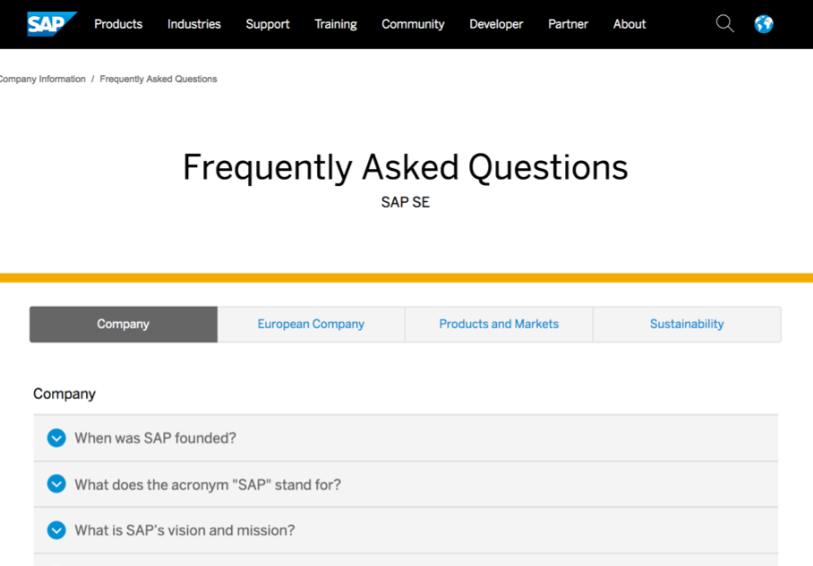
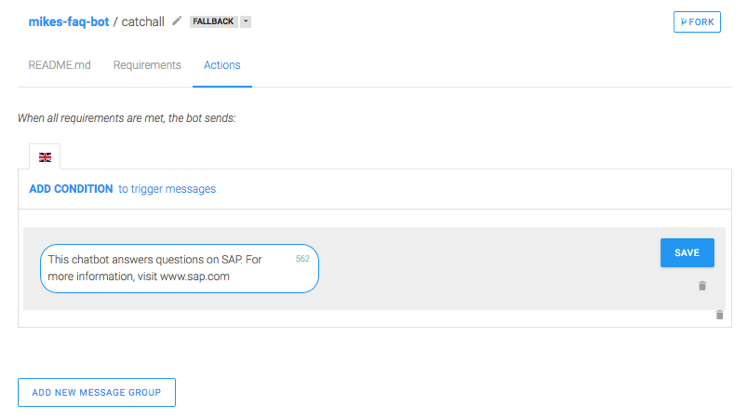

# FAQ chatbot tutorial
*This workshop was adapted from a workshop made by Michael Erickson, posted on the Recast.AI website. It is available at https://recast.ai/blog/best-chatbot-faq/*

Using chatbots to answer frequently asked questions (FAQs) is one of the most common use cases for conversational applications in the enterprise settings. SAP supports this through Recast.AI. In this tutorial, I’ll walk through the formulation and creation of the best chatbot for FAQs on Recast.AI. I’ll also provide some hints along the way to improve the user experience.

### Prerequisites

Before we get started, you’ll need:

- A Recast.AI account (sign up here!)
- A question-answer FAQ to be converted to a chatbot

### Refresher on the Basics

Recast.AI divides natural language processing (NLP) objects into three objects: intents, expressions, and entities. After each definition, I’ll provide an example in parenthesis.

- **Intent**: an objective the user wants to achieve (Request Vacation)
- **Expression**: a phrase that a person would say to express desire to achieve some objective (“I need to book vacation for October” or “Submit a vacation request for October 12th”)
- **Entity**: a word or phrase that has some business value (Date, Time)

Recast.AI also uses skills to construct interactions that the chatbot consumer steps through.

### Formulating the Problem

For an FAQ, we will leverage the objects above as:

- Intents will store the FAQ’s questions
- Expressions will store the variations of the question
- Entities will not need to be used

The FAQ’s answers can be provided as a Message Action in a Skill (one skill for each question). If this doesn’t yet make sense, don’t worry- it will.

For this tutorial, I will use this SAP FAQ as an example.

### Making the bot

Go ahead and create a new bot

#### Load the Questions
Creating a Question

Navigate to the ‘Train’ tab. If you selected one of the packages, you will notice some intents already exist. We’re going to begin by pressing “+ Create” to add our first question

#### Name a Question
We’ll need to give our first intent a name. 

To make Step 3 simpler, I suggest giving it a name that related to the subject of the question. 

The first question for my FAQ is “When was SAP founded?” so I’ll name mine ‘date_founded’. 

Once completed, the screen should look similar to the screenshot below.

#### Load Expressions
Expressions can be added in the “Add an expression” field. 

I suggest always beginning with the question text as it exists in the FAQ document. 

Then, proceed to add many variations.

To finalize the process, repeat steps a) through c) until all questions have been added!

#### Load the Answers
Create a skill

Navigate to the ‘Build’ tab. 

To create a new Skill click the black “+” box on the left. As you remember from the introduction, we will be creating one Skill for each question-answer pair.

In the pop-up, select ‘Business’ for the Skill type and give it a descriptive name. I am still using my question from Step 2-b, so I will name mine ‘q_date_founded’

#### Configure the Dialog
Opening the new Skill, you can see that there are four tabs. 

We will only use Triggers (what needs to happen to cause the Skill to activate) and Actions (what the Skill actually does).

Open the Trigger tab and click the ‘if’ box to trigger the configuration pop-up. 

In the ‘User Says’ column, you will find all of the intents you created preceded by an ‘@’. Select the corresponding intent and press ‘SAVE’.

Now navigate to the Actions tab. Press “ADD NEW MESSAGE GROUP” button, then choose that you want to create a ‘Text’ message. In the following screen, copy and paste the answer to the text box and save.

Repeat until all questions have the answers entered.

#### Add a Catch-all Skill
Your users may not fully understand everything the chatbot is capable of answering. 

We’ll also create a ‘catch all’ skill to handle queries the chatbot does not recognize.

#### Create Catch-all Skill
Create a new skill as a FALLBACK.

#### Configure the action:
Create a text indication that lets the user know what the chatbot understands and where the user can go to get more information.

#### You’re done! Now try using it.

By clicking the ‘CHAT WITH YOUR BOT’ button, you can try the interactions. 

### Troubleshooting

Congratulations on being an FAQ Bot builder!

If you’re not satisfied, never fear: the best chatbot is hard to build, but with time and help, you’ll get there. Here are the common pitfalls to check:

If the wrong answer is being presented, this is likely due to either
- A lack of data or a lack of diverse data. Collect some more data from people you have not spoken with yet (getting more diverse speaking patterns) and aim to increase the data volume by 50%.
- Misconfigured Triggers in one or more Skill.

If multiple answers are being returned, it is likely due to more than one Skill being triggered by the same intent.

If no answer is returned, it is likely that multiple answers are retrieved. Just like people, chatbots struggle to differentiate closely related topic. To remedy this, you can either:
- Add more differentiating expressions to the two confused intents
- Manually resolve this by hardcoding the ‘trigger’ tab. My chatbot has to very similar intents (seeking information about recent acquisitions and seeking information on upcoming acquisitions). I choose that when the chatbot is confused, it should always defer to presenting information about upcoming acquisitions.
