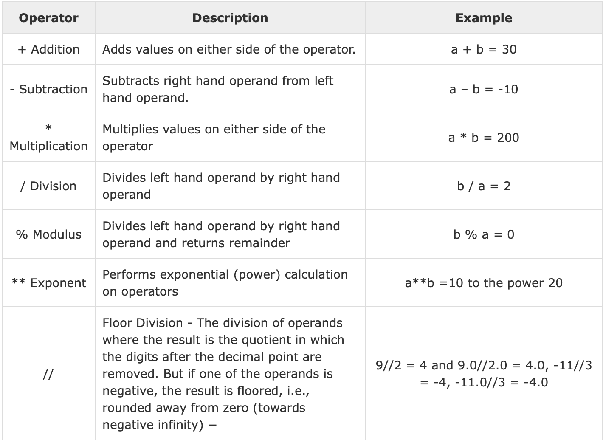

# About Python

Python is a widely-used, interpreted, object-oriented, and high-level programming language with dynamic semantics, used for general-purpose programming. It was created by **Guido van Rossum**, and first released on February 20, 1991.

Python Goals
-   an  **easy and intuitive**  language just as  **powerful**  as those of the major competitors;
-   **open source**, so anyone can contribute to its development;
-   code that is as understandable as  **plain English**;
-   suitable  **for everyday tasks**, allowing for short development times.


# Basic Python

## "Hello World!"

The most basic exercise when learning any new programming language is printing the phrase "Hello World"

 1. To begin create a new file named helloworld.py
 2. To print a phrase in python you must make a call to the print() method; to do this you simply type print()
 3. If you try to run the code the way it is now nothing would appear; to actually display "Hello World!" you have to insert the words "Hello World!" with quotations into the parentheses.

## Variables

Variables in python are different from most other languages. There is no need to declare the type of a variable explicitly; instead, python infers the type of the variable based on the value you assign to it.

For Example:
The line
```
    word = "bus"
```
will initiate the variable `word` as a String because it uses quotations.

Python will do the same thing for all other supported datatypes including
-   Numbers
-   Lists
-   Tuples
-   Strings
-   Sets
-   Dictionaries

We will only cover number, strings, and lists in this tutorial

### Numbers

Numbers include negative and positive integers and decimals
All of the following lines are valid python code
```
    num = 2
    dec = 3.2
    bignum = 32030492
```    
Note: Python actually divides number into multiple datatypes but does not reveal the actual type to the programmer. You can see the actual type of the number using the type() method.

#### Operations

Python supports all the common arithmetic operations you would expect



Note: `x = x + 2` can be abbreviated as `x += 2`

### Strings

String are any character or group of characters which are initialized with quotations.
Example:
```
    word = "hello"
    a = "1AsdFsa"
    b = "#4.2@4Isn"
```    
#### Concatenating

Strings can be combined in the following manner.
```
    a = "Hello"
    b = "World"
    c = a + " " + b
    # c is set equal to "Hello World"
```
#### Slicing

Strings in python can be divided using a special "slicing" syntax

```
    a[n]         # gets nth character in string
    a[start:end] # string start through end-1
    a[start:]    # string start through the rest of the string
    a[:end]      # string from the beginning through end-1
    a[:]         # a copy of the whole string
```
Example:
```
    a = "You won't believe it's not butter."
    print(a[:3])  # prints "You"
    print(a[2:6]) # prints "u wo"
    print(a[4:])  # prints "won't believe it's not butter."
```  
### Lists

Lists are one of the most versatile python types and have a huge number of uses.

A list is a collection of other variables. Lists in python can hold any number of variables and are not dependent on the type of the variables that they are holding.

Example: 
```
    nums = [1,3,2]
    strs = ["hi","hello","hola"]
    mix = ["one",2,"three"]
```  
#### Adding and removing elements to/from a list

You can use .append(element) to add elements to a list.
.remove(element) removes the first occurrence of an element from a list
Example:
```
    a = [1,2,3,4]
    a.append(5)
    print(a) # prints [1,2,3,4,5]
    a.remove(2)
    print(a) # print [1,3,4,5]
```
   
#### Slicing

The syntax for slicing used for strings can also be applied to lists.
```
      a = [1,2,3,4,5]
      b = a[1:3]
      print(b) # prints  [2,3]
```

## For Loops

For loops are one of the most important concepts in python.
Any code put inside of a for loop will be repeated however many times its parameters dictate.
```
    # Syntax for the for loop
    for i in range(num):
	    # code to be looped over
	# num is the number of times the loop will be executed
```
	
Example:
```
    for i in range(5):
	    print(i)
	# The above prints
	0
	1
	2
	3
	4
```
### Enhanced For Loop
The enhanced for loop can be used when one wants to iterate directly over the contents of a list.
```
    list = ["a","b","c"]
	for x in list:
        print(x)
	# The above prints
	a
	b
	c
```
## Conditionals
If statements allow you to add logic to your programs. The if statement in python is composed of a condition and the code which will run.

```
    x = 2
    if x == 2:
        # Do something
    else:
        # Do something else
    # The code above will check if the value of x is 2 and evaluate different pieces of code depending on the truthfulness of the condition
```

There are several truth operators in python which allow you to evaluate statements

```
    a == b # equals
    a > b  # a is greater than b
    a < b  # a is less than b
    a >= b # a is greater than or equal to b
    a <= b # a is less than or equal to b
```

# Exercises

 1. Given a list of integers write a program that prints odd or even for each element. (Hint: Use modulus)
 2. Given a list of strings print an acronym. Example: ["Body", "Odor"] would output "BO"
 3. Given a string print the reverse of the string.

# Exercises 2

1. Given a list of arbitrary length filled with random integers, print the list sorted from smallest to greatest. Example Input: [3,2,5,1]
2. Given a string of words seperated with spaces create a program that splits the string into a list and prints the final list. Example Input: ["Hello darkness my old friend"]
3. Given a list of words print the words in alphabetical order. Hint: Lookup the ord() function and lower() function
4. Write a program which will find all such numbers which are divisible by 7 but are not a multiple of 5,between 2000 and 3200
5. Write a program which can compute the factorial of a given numbers.

Bonus:

Read about the input() function here: https://www.programiz.com/python-programming/methods/built-in/input

Try building a 4 function calculator with user input.

# Python Modules

Today we will be using the online IDE repl.it to experiment with several python modules and build a web scraper for stocks.

What is a "module"?

A module is code that someone else has written that can be imported into a python program to be used.

For example, instead of creating a program to represent the date and time you can use the date time module in python

To use a module the `import` statement is required

````
import datetime
````

To show the use of modules we will build a stock tracker which scrapes the NASDAQ and will save data on apple stocks for us. This is useful for algotrading which uses algorithms to predict the future prices of stocks.

We will scrape the price of Apple (AAPL) stocks from https://www.nasdaq.com/symbol/aapl

To begin the program we will import all of the modules needed for our program. The first 2 modules we will need are BeautifulSoup4 which allows us to easily parse a webpage into an understandable format, and requests which allows us to receive the raw HTML of the webpage. We can import these modules as follows.

````
from bs4 import BeautifulSoup
import requests
````

BeautifulSoup is part of a larger module called bs4 which is why we use the `from` keyword.

We will also need the time and date time packages to record the times of the prices we scrape.

````
from datetime import datetime
import time
````

Next we want to set up a dictionary object that stores a key which will be the time, and a value which will be the price of the stock at that time.

````
timeseries = dict()
````

We need an infinite loop to continuously collect datapoint. We only want to collect the price of the stock every 5 seconds so we will use the time module to force the program to wait for 5 seconds on each iteration of the loop.

````
while True:
	#More code will go here
	time.sleep(5)
````

To get the raw HTML for the page we use the requests module.

````
while True:
	page = requests.get("https://www.nasdaq.com/symbol/aapl/real-time")
	time.sleep(5)
````

Next we want to create a BeautifulSoup object which allows us to easily scrape the price of the stock

````
while True:
	page = requests.get("https://www.nasdaq.com/symbol/aapl/real-time")
	soup = BeautifulSoup(page.text,'html.parser')
	time.sleep(5)
````

Now we extract the price from the `soup` object. The class parameter is the HTML class that contains the price on the website. You can identify the name of the class by using inspect element on the webpage.

````
while True:
	page = requests.get("https://www.nasdaq.com/symbol/aapl/real-time")
	soup = BeautifulSoup(page.text,'html.parser')
	price = soup.find(class_='qwidget-dollar').text[1:]
	time.sleep(5)
````

To add an entry to our dictionary we access the dictionary with square brackets and put the key of the new entry in the square brackets. Additionally we use the date time module to get the current time. The str() method converts the date into a string and the float() method converts the price, which is a string, into a number.

````
while True:
	page = requests.get("https://www.nasdaq.com/symbol/aapl/real-time")
	soup = BeautifulSoup(page.text,'html.parser')
	price = soup.find(class_='qwidget-dollar').text[1:]
	timeseries[str(datetime.now())] = float(price)
	time.sleep(5)
````

Finally we want to save our dictionary into a text file so that we can view the entirety of our results. The code to save data into a file is a little bit more complicated than things we have seen in the past so for now you can use the code provided. Make sure to create a file in the same folder as your python code called "file.txt".

````
while True:
	page = requests.get("https://www.nasdaq.com/symbol/aapl/real-time")
	soup = BeautifulSoup(page.text,'html.parser')
	price = soup.find(class_='qwidget-dollar').text[1:]
	timeseries[str(datetime.now())] = float(price)
	with  open("file.txt",  "w")  as text_file:
		text_file.write(str(timeseries))
	time.sleep(5)
````

Optionally, we can use a print statement to view the results as our script collects stock prices.

````
while True:
	page = requests.get("https://www.nasdaq.com/symbol/aapl/real-time")
	soup = BeautifulSoup(page.text,'html.parser')
	price = soup.find(class_='qwidget-dollar').text[1:]
	timeseries[str(datetime.now())] = float(price)
	with  open("file.txt",  "w")  as text_file:
		text_file.write(str(timeseries))
	print(str(datetime.now()) + " " + price)
	time.sleep(5)
````

So we have seen that python modules allow us to build practical programs extremely easily. There are thousands of python programs available for you to try. See if you can think of other uses for BeautifulSoup or any other modules you find online.

# Challenges

Visit (https://www.dataquest.io/blog/web-scraping-tutorial-python/) and learn more about how to use the module BeautifulSoup4. You can use the same python project as last week for these challenges.

1. *Easy* Use BS4 to scrape the price of Shrek the Movie from [Amazon](https://www.amazon.com/Shrek-4-Movie-Collection-Mike-Myers/dp/B01E8CKGUE/) and print the price.
2. *Medium* Using what you learned from the tutorial above write a program that scrapes the synopsis and rating of the shrek movie from IMDb and prints them.
3. *Hard* Write a program that scrapes (time.is) and prints the time when the time updates on (time.is).