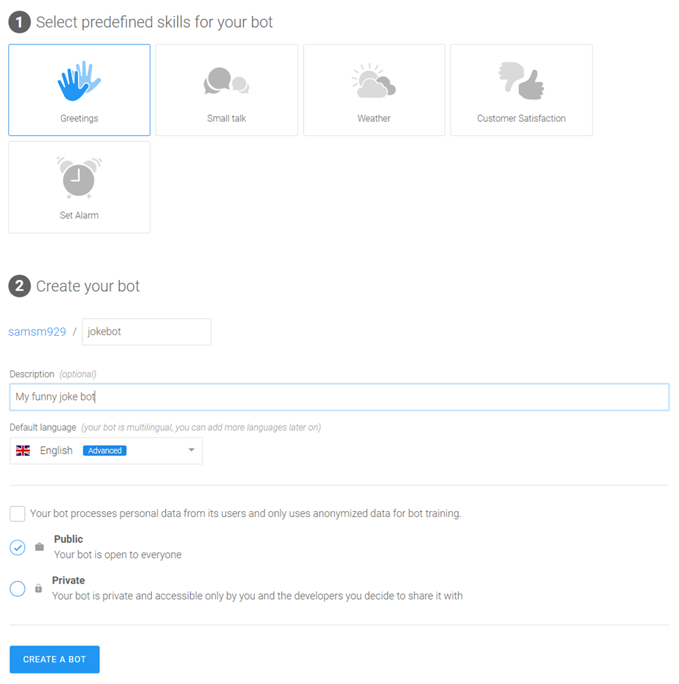

# Making Your First Bot Using Recast.ai

### Getting Started with Recast.ai

[Recast.AI](https://recast.ai) is a platform for building and trianing bots. We will utilize their services to get started on basic bot-making. 

As a method of storing all your code in the future, and as tool to connect your Recast.AI account with, we will use [Github](https://github.io). You can sign up for a github [here](https://github.io) and then for Recast.AI [here](https://github.com/login?client_id=02e7d65e4478690814f2&return_to=%2Flogin%2Foauth%2Fauthorize%3Fclient_id%3D02e7d65e4478690814f2%26scope%3Duser%253Aemail%252Cprofile%26state%3DeyJ0eXAiOiJKV1QiLCJhbGciOiJIUzUxMiJ9.eyJvcmlnaW4iOiJwbGF0Zm9ybSIsImZyb20iOiJmcm9tLXNpZ251cCIsInNlcnZpY2UiOm51bGwsInVzZXIiOm51bGwsImJvdCI6bnVsbH0.A_m5JMk5T8b2sKPlKIznluqc2jeoJkOK4UFdNU3JdGpwLkjcxQpKZd47tXg8IVa_rcO7S9rKndB0bxQQ3KLyjA).

### Creating the Bot

Once you’re logged in, you can create your first bot. Click on the button “Start with a template”, or just on + NEW BOT in the header section.

Choose “Create a complete chatbot”.

You can choose one or many pre-defined skills for you bot. This will help you get started faster. Just select “Greetings” for now, but I encourage you to check the others later.

Choose your name. “joke-bot” would be appropriate.

Add a description. “My funny joke bot” or something similarly descriptive.

Set English as the default language.

You can keep your bot public as there is no private info, but you can change this setting later.

