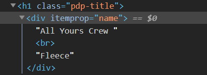
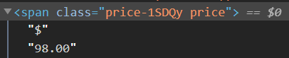

# Workshop 5: Web Scraping Store Prices

We’ll be learning how to apply what we learned about Web Scraping from our last lesson in the real world! For prices on Lululemon (or any website of your choosing) you will use web scraping to track when an item drops down to your ideal price.  When your item’s price drops to that amount, you will receive an email. 

### Step 1: Setting up Repl
Before we begin coding, you must set up a text editor. We recommend using repl.it

If you do not have an account already, register 

Once you are logged in, create a new repl with the language “python”

You are now ready to begin coding!


### Step 2: Setting up the Python File
In order for the program to get the information from a website, it needs to request the code from the server. 
To do this, import the request package and the BeautifulSoup Package:
```python
import requests
from bs4 import BeautifulSoup
```
Then you can choose a website with the product to request from:
```python
# Collect and parse from lululemon website
page = requests.get(“https://shop.lululemon.com/p/womens-outerwear/All-Yours-Crew/_/prod9370045?color=46793”) 
soup = BeautifulSoup(page.text, 'html.parser')
```


### Step 3: Extracting Page Title
Next, inspect your website's code by right clicking your mouse and selecting inspect. See which elements have the title and price because these will be the elements you target. 

<br/>

<br/><br/><br/>

<br/><br/><br/>

The title has the h1 tag with class name "pdp-title" and the price has the span tag with class name "price-1SDQy price"

### Step 4: Locating Title and Price
Once you are inspecting your code, use the find function to locate the title and and price using the tags you found in step 3. 

```python
title = soup.find("h1", {"class": "pdp-title"}).getText()
price = soup.find("span",{"class": "price-1SDQy price"}).getText()
```

### Step 5: Converting the Price
Converting the price is the last step to extracting this information.  The first index must be 1 rather than 0 since you are skipping the dollar sign on the website.  The last index is regarding how many digits you have

You lastly have to print the converted price in order to see the information you just extracted

```python
converted_price = float(price[1:4])
print(converted_price)
```


