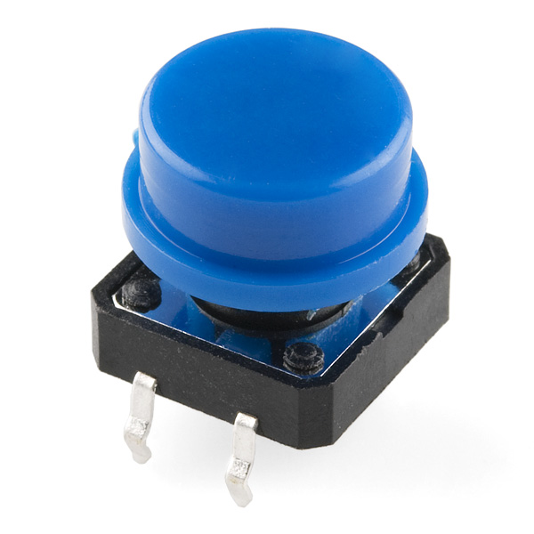

# Ready, Set, GO! 

In this workshop, we will build a small stop light with LEDs and a button. The light will turn from
red to yellow, and only to green when you press the button. You will learn how to use a button in both
a circuit and as an input, how to use Arduino's serial monitor, and how to control multiple LEDs to respond
to a button.

You will need:
<ul>
    <li>1 Arudino UNO</li>
    <li>1 breadboard</li>
    <li>1 red LED</li>
    <li>1 yellow LED</li>
    <li>1 green LED</li>
    <li>1 push button</li>
    <li>3 220ohm resistor</li>
    <li>1 10Kohm resistor</li>
    <li>jumper wires</li>
</ul>

## The Button

In this workshop, we will be using a new component: a button. Buttons are often used as part of circuits, or solely an 
input for Arduinos. Buttons work by making an electrical connection between its pins once pressed. 

We will
be using a <b>momentary push button</b>, meaning normally, there is no electrical connection between certain pins. However,
once the button is pressed, the connections are made, and once the button is released, the connections are immediately
terminated.



If we look at our button, there are 4 pins. Orient the button so that two pins are sticking out the left side
and two pins are sticking out the left side. The two top pins are always electrically connected, and the same goes
for the two bottom pins, but the top and the bottom are not connected. When you press the button, all four pins
are connected and electricity can flow through them. This is pictured below:


### Simple Button Circuit

We will now make a simply circuit where you turn on a LED with a button. This will be identical to the
circuit made in the last workshop that lit an LED, but with a button between the anode of the LED
and the positive rail.

The button is always placed on top of the bridge in the middle of the breadboard. As always, <b>first</b> connect the 
power rails of the breadboard to the Arduino. <b>Next</b>, connect the positive rail to the bottom row of the button.
<b>Then</b>, connect the longer leg of the LED to the top row of the button, and the shorter leg to an empty row.
<b>Finally</b>, connect one end of a 220ohm resistor to the same row as the shorter leg of the LED and the other 
end to ground (negative rail). <b>Alternatively</b>, if the other end of the resistor can not reach the negative rail,
you can connect the other end of the resistor to an empty row, and use a jumper wire to connect it to ground.

An example circuit is shown below:


Now, if you press the button, the LED should light up!

## Stop Light

### Step 1: Button as Input

To use the button as an input for the Arduino to read, we must wire it up to one of the digital pins (as it
has only two modes: pressed and not-pressed). To do so, we must <b>first</b> remove the LED, the resistor, and the 
jumper wire connected to ground.

<b>Next</b>, connect the top row to digital `pin 2`. <b>Then</b>, use a 10k ohm resistor to connect the top row to ground.
This functions as a <b>pull-down resistor</b>. An example diagram is show below:


A pull-down resistor is needed, as digital input pins have three states: high, low, and floating. Floating occurs
when nothing is connected to it, so the state is ambiguous. Thus, we must 'pull-down' the pin to low. Then, when the
button is pressed, the pin would read high.

### Step 2: Testing the Button (w/ serial monitor)

We can test the button by using the serial monitor, an output screen you can use when the Arudino is connected
to a computer.

<b>First</>, declare the `int button = 2;` to indicate the pin the button is connected to. <b>Next</b>, in the `setup()` 
declare `pinMode(button, /////INPUT);`. <b>Then</b>, we  want to use `Serial.begin(9600);` to open a serial port at 9600 bps. 

In the `loop()` section of the code, we can use `Serial.println()` to print something to the serial monitor. We want to print the value that the pin
the button to is reading, so we can use `digitalRead()` to result in `Serial.println(digitalRead(button));`. 
We want to add a small delay between readings for stability, so add `delay(1);`.

The code should look like this:

```
/*
by Jeffrey Yu, February 19, 2018
for Roslyn Code Club's "Ready, Set, GO!" workshop
*/

int button = 2; //pin the button is connected to

void setup() {
    pinMode(button, INPUT); //declare pin 2 to be an INPUT
    Serial.begin(9600); // open the serial port at 9600 bps:   
}

void loop() {
    Serial.println(digitalRead(button));    //print to serial monitor the reading of the button
    delay(1);   //adds 1 milliseconds delay for stability
}
```

Verify and upload your code. Then open up the serial monitor from the left hand side. 0s should be appearing
continously. Press the button and you should see 1s start to appear. Once you release the button, 0s should
start appearing again.

### Step 3: Setting up the LEDs

To progress towards our final project of creating a stop light, we must connect our LEDs as outputs to the Arduino.
Take a red LED and place it in the breadboard such that each lead is in a different row, with the
longer lead closer to the bottom. Then, move down a few rows and repeat with a yellow and green LED.

Next, take 3, 220 ohm resistors and for each LED, connect the shorter lead (closer to the top) to ground. Then,
using jumper wires, connect the longer lead (closer to the bottom) of the red, yellow, and green LEDs to digital pins
`~11`, `~10`, and `~6`, respectively. The final setup should look something like this:


### Step 4: Coding 

Now we get to the fun part, coding! So we want the sequence to be this: all LEDs start off as off, then
when the button is pressed once, the <font color="red">red LED</font> turns on for 1 seconds, next  the red LED turns off and the <font color="#cccc00">yellow LED</font> 
turns on. Then, when the button is pressed again, the yellow LED turns off and the <font color="green">green LED</font> turns on for 10 seconds.

For this program, make a new file.

#### Declaring Variables
Before the `setup()`, we want to declare all the variables for pins that have something connected to them. Your
code may look something like this:

```
int button = 2;     //pin the button is connected to
int redLED = 11;    //pin the red LED is connected to
int yellowLED = 10; //pin the yellow LED is connected to
int greenLED= 6;    //pin the green LED is connected to
```

#### Setup

Next, in the `setup()`, we declare what each pin is, resulting in something like this:
```
void setup() {
    pinMode(button, INPUT);     //declare pin 2 to be an INPUT
    pinMode(redLED, OUTPUT);    //declare pin 11 to be an OUTPUT
    pinMode(yellowLED, OUTPUT); //declare pin 10 to be an OUTPUT
    pinMode(greenLED, OUTPUT);  //declare pin 6 to be an OUTPUT
}
```

#### Body

Then, in the main body of the code (`loop()`), we can write our program. 

The first step is to wait for the button to be pressed. To do this, we can use a `while()` loop, with the condition
of while the button value (using `digitalRead()`) is 0, it repeats the loop containing a `delay()`. This might 
look something like this:
```
    while(digitalRead(button)==0){  //while the button is not pressed
      delay(10);    //wait for 10 seconds
    }
```

When the button is pressed, the program will move foward. So next, we want to set red LED output value to `HIGH` using `digitalWrite()`, 
wait for 1 second, set it back to `LOW`, and then set the yellow LED value to `HIGH`. An example is show below:
```
    digitalWrite(redLED, HIGH);     //turns on red LED
    delay(1000);                    //wait 1 seconds
    digitalWrite(redLED, LOW);      //turns off red LED
    digitalWrite(yellowLED, HIGH);  //turns on yellow LED
```

Finally, we want to use the same `while()` loop to wait for a button press again. Then, have the yellow LED turn off and 
the green LED turn on for 5 seconds, as shown here:

```
    while(digitalRead(button)==0){  //while the button is not pressed
      delay(10);                    //wait for 10 seconds
    }
    
    digitalWrite(yellowLED, LOW);   //turns off yellow LED
    digitalWrite(greenLED, HIGH);   //turns on green LED
    delay(5000);                    //waits for 5 seconds
    digitalWrite(greenLED, LOW);    //turns off green LED
```

After all this, the program will simply loop again. 

You can now click verify and upload to the Arduino and test the program out.

#### Finished Code
The finished code should look something like this:
```
/*
by Jeffrey Yu, February 19, 2018
for Roslyn Code Club's "Ready, Set, GO!" workshop
*/

int button = 2;     //pin the button is connected to
int redLED = 11;    //pin the red LED is connected to
int yellowLED = 10; //pin the yellow LED is connected to
int greenLED= 6;    //pin the green LED is connected to

void setup() {
    pinMode(button, INPUT);     //declare pin 2 to be an INPUT
    pinMode(redLED, OUTPUT);    //declare pin 11 to be an OUTPUT
    pinMode(yellowLED, OUTPUT); //declare pin 10 to be an OUTPUT
    pinMode(greenLED, OUTPUT);  //declare pin 6 to be an OUTPUT
}

void loop() {
    while(digitalRead(button)==0){  //while the button is not pressed
      delay(10);    //wait for 10 seconds
    }
    
    digitalWrite(redLED, HIGH);     //turns on red LED
    delay(1000);                    //wait 1 seconds
    digitalWrite(redLED, LOW);      //turns off red LED
    digitalWrite(yellowLED, HIGH);  //turns on yellow LED
    
    while(digitalRead(button)==0){  //while the button is not pressed
      delay(10);                    //wait for 10 seconds
    }
    
    digitalWrite(yellowLED, LOW);   //turns off yellow LED
    digitalWrite(greenLED, HIGH);   //turns on green LED
    delay(5000);                    //waits for 5 seconds
    digitalWrite(greenLED, LOW);    //turns off green LED
}
```

### Step 5: Challenges

Congratulations (hopefully) your code works now!

You learned a lot in this workshop and there are a lot of things you can do with them. Here are a few
challenges you can try utilizing what you learned (only require changing program, not circuits);

<ol>
    <li>Instead of the green LED staying lit for only 5 seconds, it stays lit until the next button press.</li>
    <li>Instead of the green LED staying lit for only 5 seconds, it stays lit for as long as you hold the button.</li>
    <li>A new program such that while the button is being held down, each light flashes in the order red, yellow, green.</li>
    <li>A program that does the same thing as program 3, but only while the button is not being pressed. </li>
</ol>
